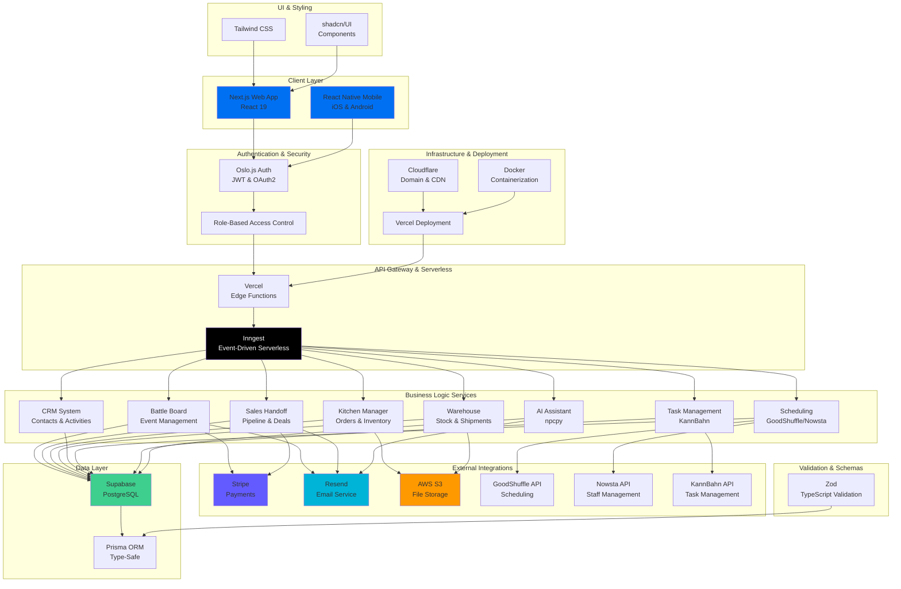

# Enterprise Operations Management System (HQ)
## Unified Command Center Architecture

---

## System Overview

This enterprise operations management platform consolidates multiple business systems into a unified, scalable headquarters (HQ) application. It serves as the central command center for:

- **Event Management** (Battle Boards)
- **Sales Operations** (Sales Handoff)
- **Kitchen Operations** (Kitchen Manager)
- **Warehouse Management**
- **Customer Relationship Management (CRM)**
- **Task Management** (KannBahn)
- **Staff Scheduling** (GoodShuffle, Nowsta)
- **Payment Processing** (Stripe)
- **Event Planning** (Total Party Planner)
- **Agentic AI** (npcpy)

---

## Technology Stack

### Core Framework
- **Next.js 16** - Full-stack React framework
- **React 19** - UI component library
- **React Native** (Mobile companion app)

### Data & ORM
- **Prisma** - Next-generation TypeScript ORM
- **Supabase** - Serverless PostgreSQL database
- **Zod** - TypeScript-first schema validation

### Authentication & Security
- **Oslo.js** - Zero vendor lock-in authentication
- **JWT & OAuth2** support
- **WebAuthn** for passwordless authentication

### Frontend
- **Tailwind CSS** - Utility-first CSS framework
- **shadcn/UI** - Accessible, reusable components
- **TypeScript** - Type-safe development

### Backend Services
- **Inngest** - Serverless event-driven functions
- **Resend** - Email delivery service
- **AWS S3** - File storage
- **Stripe** - Payment processing

### Infrastructure & Deployment
- **Vercel** - Next.js deployment platform
- **Cloudflare** - Domain & CDN
- **Git** - Version control

---

## Directory Structure

```
hq-operations/
├── apps/
│   ├── web/                          # Main Next.js dashboard application
│   │   ├── app/
│   │   │   ├── (dashboard)/
│   │   │   │   ├── layout.tsx
│   │   │   │   └── page.tsx
│   │   │   ├── (auth)/
│   │   │   │   ├── login/
│   │   │   │   ├── register/
│   │   │   │   └── forgot-password/
│   │   │   ├── api/
│   │   │   │   ├── auth/
│   │   │   │   ├── users/
│   │   │   │   ├── webhooks/
│   │   │   │   └── integrations/
│   │   │   └── error.tsx
│   │   ├── components/
│   │   │   ├── common/
│   │   │   │   ├── Navbar.tsx
│   │   │   │   ├── Sidebar.tsx
│   │   │   │   └── Footer.tsx
│   │   │   ├── dashboard/
│   │   │   │   ├── Overview.tsx
│   │   │   │   ├── KPIDashboard.tsx
│   │   │   │   └── ActivityFeed.tsx
│   │   │   ├── battle-boards/
│   │   │   │   ├── EventBoard.tsx
│   │   │   │   ├── ShiftBoard.tsx
│   │   │   │   └── NotificationCenter.tsx
│   │   │   ├── sales/
│   │   │   │   ├── SalesHandoff.tsx
│   │   │   │   ├── PipelineView.tsx
│   │   │   │   └── DealTracker.tsx
│   │   │   ├── kitchen/
│   │   │   │   ├── KitchenBoard.tsx
│   │   │   │   ├── OrderQueue.tsx
│   │   │   │   └── InventoryManager.tsx
│   │   │   ├── warehouse/
│   │   │   │   ├── StockManager.tsx
│   │   │   │   ├── PickQueue.tsx
│   │   │   │   └── ShipmentTracker.tsx
│   │   │   ├── crm/
│   │   │   │   ├── ContactManager.tsx
│   │   │   │   ├── DealsView.tsx
│   │   │   │   └── ActivityTimeline.tsx
│   │   │   ├── scheduling/
│   │   │   │   ├── ScheduleBoard.tsx
│   │   │   │   ├── ShiftPlanner.tsx
│   │   │   │   └── StaffAvailability.tsx
│   │   │   ├── tasks/
│   │   │   │   ├── TaskBoard.tsx
│   │   │   │   ├── KanbanBoard.tsx
│   │   │   │   └── TaskTimeline.tsx
│   │   │   └── integrations/
│   │   │       ├── StripePanel.tsx
│   │   │       ├── AIAssistant.tsx
│   │   │       └── ThirdPartyApps.tsx
│   │   ├── hooks/
│   │   │   ├── useAuth.ts
│   │   │   ├── useBattleBoard.ts
│   │   │   ├── useSales.ts
│   │   │   ├── useKitchen.ts
│   │   │   └── useWebSocket.ts
│   │   ├── lib/
│   │   │   ├── auth.ts
│   │   │   ├── api-client.ts
│   │   │   ├── utils.ts
│   │   │   └── constants.ts
│   │   ├── styles/
│   │   │   └── globals.css
│   │   ├── middleware.ts
│   │   ├── next.config.ts
│   │   ├── tsconfig.json
│   │   ├── tailwind.config.ts
│   │   └── package.json
│   │
│   ├── mobile/                       # React Native mobile app
│   │   ├── app/
│   │   │   ├── (auth)/
│   │   │   ├── (tabs)/
│   │   │   │   ├── dashboard.tsx
│   │   │   │   ├── battle-board.tsx
│   │   │   │   ├── sales.tsx
│   │   │   │   ├── tasks.tsx
│   │   │   │   └── profile.tsx
│   │   │   └── _layout.tsx
│   │   ├── components/
│   │   │   ├── common/
│   │   │   ├── battle-board/
│   │   │   ├── sales/
│   │   │   ├── kitchen/
│   │   │   └── tasks/
│   │   ├── hooks/
│   │   ├── lib/
│   │   ├── app.json
│   │   └── package.json
│   │
│   └── api/                          # Backend API (Inngest & Edge Functions)
│       ├── src/
│       │   ├── functions/
│       │   │   ├── auth/
│       │   │   │   ├── login.ts
│       │   │   │   ├── register.ts
│       │   │   │   └── refresh-token.ts
│       │   │   ├── battle-board/
│       │   │   │   ├── create-event.ts
│       │   │   │   ├── update-shift.ts
│       │   │   │   └── send-notifications.ts
│       │   │   ├── sales/
│       │   │   │   ├── create-deal.ts
│       │   │   │   ├── update-pipeline.ts
│       │   │   │   └── generate-handoff.ts
│       │   │   ├── kitchen/
│       │   │   │   ├── process-order.ts
│       │   │   │   ├── update-inventory.ts
│       │   │   │   └── alert-kitchen.ts
│       │   │   ├── warehouse/
│       │   │   │   ├── process-pick.ts
│       │   │   │   ├── track-shipment.ts
│       │   │   │   └── update-stock.ts
│       │   │   ├── crm/
│       │   │   │   ├── sync-contacts.ts
│       │   │   │   ├── activity-logger.ts
│       │   │   │   └── lead-scorer.ts
│       │   │   ├── scheduling/
│       │   │   │   ├── assign-shift.ts
│       │   │   │   ├── check-availability.ts
│       │   │   │   └── notify-staff.ts
│       │   │   ├── payments/
│       │   │   │   ├── process-payment.ts
│       │   │   │   ├── webhook-stripe.ts
│       │   │   │   └── generate-invoice.ts
│       │   │   ├── ai/
│       │   │   │   ├── ai-assistant.ts
│       │   │   │   ├── anomaly-detection.ts
│       │   │   │   └── recommendations.ts
│       │   │   └── integrations/
│       │   │       ├── goodshuffle-sync.ts
│       │   │       ├── nowsta-sync.ts
│       │   │       └── kannbahn-sync.ts
│       │   ├── middleware/
│       │   │   ├── auth.ts
│       │   │   ├── validation.ts
│       │   │   └── error-handler.ts
│       │   ├── lib/
│       │   │   ├── prisma.ts
│       │   │   ├── supabase.ts
│       │   │   ├── stripe.ts
│       │   │   ├── s3.ts
│       │   │   ├── resend.ts
│       │   │   └── utils.ts
│       │   └── types/
│       │       ├── auth.ts
│       │       ├── events.ts
│       │       ├── sales.ts
│       │       ├── kitchen.ts
│       │       ├── warehouse.ts
│       │       ├── crm.ts
│       │       └── common.ts
│       └── package.json
│
├── packages/
│   ├── database/                     # Shared Prisma schema
│   │   ├── prisma/
│   │   │   ├── schema.prisma
│   │   │   └── migrations/
│   │   ├── src/
│   │   │   └── index.ts
│   │   └── package.json
│   │
│   ├── shared/                       # Shared types, utilities, constants
│   │   ├── src/
│   │   │   ├── types/
│   │   │   │   ├── auth.ts
│   │   │   │   ├── events.ts
│   │   │   │   ├── sales.ts
│   │   │   │   ├── kitchen.ts
│   │   │   │   ├── warehouse.ts
│   │   │   │   ├── crm.ts
│   │   │   │   └── common.ts
│   │   │   ├── constants/
│   │   │   │   ├── status.ts
│   │   │   │   ├── roles.ts
│   │   │   │   └── enums.ts
│   │   │   ├── utils/
│   │   │   │   ├── validation.ts
│   │   │   │   ├── formatting.ts
│   │   │   │   └── helpers.ts
│   │   │   ├── schemas/
│   │   │   │   ├── auth.ts
│   │   │   │   ├── events.ts
│   │   │   │   ├── sales.ts
│   │   │   │   └── common.ts
│   │   │   └── index.ts
│   │   └── package.json
│   │
│   ├── ui/                           # Reusable UI components
│   │   ├── src/
│   │   │   ├── components/
│   │   │   │   ├── buttons/
│   │   │   │   ├── forms/
│   │   │   │   ├── tables/
│   │   │   │   ├── modals/
│   │   │   │   ├── notifications/
│   │   │   │   ├── charts/
│   │   │   │   └── layout/
│   │   │   ├── hooks/
│   │   │   └── index.ts
│   │   └── package.json
│   │
│   ├── eslint-config/
│   ├── typescript-config/
│   └── tailwind-config/
│
├── .github/
│   ├── workflows/
│   │   ├── test.yml
│   │   ├── deploy-web.yml
│   │   ├── deploy-api.yml
│   │   ├── deploy-mobile.yml
│   │   └── db-migration.yml
│   └── CONTRIBUTING.md
│
├── docker/
│   ├── Dockerfile.api
│   ├── Dockerfile.web
│   ├── docker-compose.yml
│   └── .dockerignore
│
├── .env.example
├── .gitignore
├── turbo.json                        # Monorepo configuration
├── package.json
├── pnpm-workspace.yaml               # Package manager workspace config
├── README.md
└── LICENSE
```

---

## Database Schema Overview (Prisma)

```prisma
// Core Models
model User {
  id              String    @id @default(cuid())
  email           String    @unique
  name            String
  role            Role
  organization    Organization @relation(fields: [organizationId], references: [id])
  organizationId  String
  
  // Module access
  battleBoardAccess Boolean @default(true)
  salesAccess       Boolean @default(true)
  kitchenAccess     Boolean @default(true)
  warehouseAccess   Boolean @default(true)
  crmAccess         Boolean @default(true)
  schedulingAccess  Boolean @default(true)
  
  createdAt       DateTime  @default(now())
  updatedAt       DateTime  @updatedAt
}

model Organization {
  id              String    @id @default(cuid())
  name            String
  users           User[]
  
  // Module data
  events          BattleEvent[]
  deals           Deal[]
  orders          KitchenOrder[]
  shipments       Shipment[]
  contacts        Contact[]
  shifts          Shift[]
  
  createdAt       DateTime  @default(now())
  updatedAt       DateTime  @updatedAt
}

// Battle Board Models
model BattleEvent {
  id              String    @id @default(cuid())
  name            String
  status          EventStatus
  organization    Organization @relation(fields: [organizationId], references: [id])
  organizationId  String
  shifts          Shift[]
  
  createdAt       DateTime  @default(now())
  updatedAt       DateTime  @updatedAt
}

model Shift {
  id              String    @id @default(cuid())
  event           BattleEvent @relation(fields: [eventId], references: [id])
  eventId         String
  organization    Organization @relation(fields: [organizationId], references: [id])
  organizationId  String
  assignedStaff   User[]
  
  createdAt       DateTime  @default(now())
  updatedAt       DateTime  @updatedAt
}

// Sales Models
model Deal {
  id              String    @id @default(cuid())
  title           String
  value           Float
  stage           SalesStage
  contact         Contact    @relation(fields: [contactId], references: [id])
  contactId       String
  organization    Organization @relation(fields: [organizationId], references: [id])
  organizationId  String
  
  createdAt       DateTime  @default(now())
  updatedAt       DateTime  @updatedAt
}

// Kitchen Models
model KitchenOrder {
  id              String    @id @default(cuid())
  orderNumber     String
  status          OrderStatus
  items           OrderItem[]
  organization    Organization @relation(fields: [organizationId], references: [id])
  organizationId  String
  
  createdAt       DateTime  @default(now())
  updatedAt       DateTime  @updatedAt
}

// Warehouse Models
model Shipment {
  id              String    @id @default(cuid())
  status          ShipmentStatus
  items           ShipmentItem[]
  organization    Organization @relation(fields: [organizationId], references: [id])
  organizationId  String
  
  createdAt       DateTime  @default(now())
  updatedAt       DateTime  @updatedAt
}

// CRM Models
model Contact {
  id              String    @id @default(cuid())
  name            String
  email           String
  deals           Deal[]
  organization    Organization @relation(fields: [organizationId], references: [id])
  organizationId  String
  
  createdAt       DateTime  @default(now())
  updatedAt       DateTime  @updatedAt
}
```

---

## Architecture Diagram (Mermaid)



---

## Key Architectural Decisions

### 1. **Monorepo Structure (pnpm + Turbo)**
- Shared packages for database, types, and UI components
- Independent app deployment (web, mobile, API)
- Code reusability across all modules

### 2. **Module-Based Architecture**
Each business domain has:
- Independent data models (Prisma)
- Dedicated API routes
- Specialized UI components
- Domain-specific validation schemas

### 3. **Event-Driven Orchestration**
- Inngest handles async workflows
- Real-time updates via WebSocket
- Cross-module event propagation
- Message queue for background jobs

### 4. **Role-Based Access Control (RBAC)**
- Granular permission system
- Module-level access control
- User-level feature toggles

### 5. **Type Safety Throughout**
- TypeScript across all layers
- Zod for runtime validation
- Prisma for database types
- Shared type packages

---

## Implementation Priorities

### Phase 1: Foundation (Weeks 1-4)
1. **Setup Monorepo Structure**
   - pnpm workspaces configuration
   - Turbo build pipeline
   - Shared packages (database, types, UI)

2. **Core Authentication**
   - Oslo.js integration
   - JWT token management
   - Role-based access control

3. **Database Schema**
   - Prisma migrations
   - Supabase setup
   - Initial data models

4. **API Foundation**
   - Inngest setup
   - Edge function templates
   - Error handling middleware

### Phase 2: Core Modules (Weeks 5-12)
1. **Battle Boards Module**
   - Migrate existing Event-Battle-Board
   - Real-time notifications
   - WebSocket integration

2. **Sales Module**
   - Integrate Sales Handoff
   - Pipeline visualization
   - Deal tracking

3. **Kitchen Module**
   - Integrate Kitchen Manager
   - Order management
   - Inventory system

### Phase 3: Additional Systems (Weeks 13-20)
1. **Warehouse Module**
   - Stock management
   - Pick & pack operations
   - Shipment tracking

2. **CRM Module**
   - Contact management
   - Activity logging
   - Lead scoring with AI

3. **Scheduling Module**
   - GoodShuffle integration
   - Nowsta integration
   - Availability management

### Phase 4: Advanced Features (Weeks 21+)
1. **AI Integration**
   - npcpy integration
   - Anomaly detection
   - Predictive recommendations

2. **Payment Processing**
   - Stripe integration
   - Invoice generation
   - Payment history

3. **Analytics & Reporting**
   - Cross-module dashboards
   - KPI tracking
   - Custom reports

---

## Integration Points

### GoodShuffle Integration
- **Purpose**: Staff scheduling optimization
- **Sync Frequency**: Real-time
- **Data Flow**: Shift assignments → GoodShuffle → Mobile notifications
- **Change**: Webhook listener for schedule changes

### Nowsta Integration
- **Purpose**: Staff management & time tracking
- **Sync Frequency**: Real-time
- **Data Flow**: Staff availability → Nowsta → Schedule optimization
- **Change**: Add time tracking to shift model

### KannBahn Integration
- **Purpose**: Task and project management
- **Sync Frequency**: Real-time
- **Data Flow**: Task creation → KannBahn → Team notifications
- **Change**: Bidirectional sync for task status

### Stripe Integration
- **Purpose**: Payment processing & subscriptions
- **Sync Frequency**: Webhook-driven
- **Data Flow**: Order → Stripe → Invoice generation
- **Change**: Payment verification in order workflow

---

## Recommended Additional Components

### 1. **Analytics Engine**
- Real-time dashboards
- Cross-module KPI tracking
- Predictive analytics with AI

### 2. **Notification Hub**
- Multi-channel (SMS, email, push)
- Smart notification routing
- Do-not-disturb rules

### 3. **Document Management**
- Contract storage
- Invoice generation
- Report exports (PDF, Excel)

### 4. **Audit Logging**
- Compliance tracking
- Change history
- User activity logs

### 5. **Integration Marketplace**
- Third-party app integrations
- Webhook management
- API access control

### 6. **Mobile-First Enhancements**
- Offline-first capabilities
- Progressive Web App (PWA)
- Native mobile apps

### 7. **Advanced Reporting**
- Custom report builder
- Scheduled exports
- Real-time dashboards

### 8. **Inventory Forecasting**
- AI-driven predictions
- Automated reordering
- Seasonal adjustments

---

## Development Workflow

### Setup Instructions

```bash
# Clone the monorepo
git clone <your-repo-url>
cd hq-operations

# Install dependencies
pnpm install

# Setup environment variables
cp .env.example .env.local

# Run database migrations
pnpm db:migrate

# Start development
pnpm dev

# Run tests
pnpm test

# Build for production
pnpm build
```

### Deployment

```bash
# Deploy to Vercel
vercel deploy

# Deploy database migrations
pnpm db:deploy

# Deploy Edge Functions
pnpm deploy:functions
```

---

## Monitoring & Observability

1. **Error Tracking**: Sentry integration
2. **Performance**: Web Vitals monitoring
3. **Logging**: Structured logs with context
4. **Analytics**: User behavior tracking
5. **Health Checks**: API availability monitoring

---

## Security Considerations

1. **Data Encryption**: In transit (TLS) and at rest
2. **Environment Variables**: Secure secret management
3. **Rate Limiting**: API endpoint protection
4. **CORS**: Proper cross-origin configuration
5. **Dependency Scanning**: Regular security audits
6. **Penetration Testing**: Quarterly assessments

---

## Scalability Strategy

1. **Database**: Connection pooling, read replicas
2. **API**: Horizontal scaling with Vercel
3. **Storage**: S3 with CloudFront CDN
4. **Caching**: Redis for session/data caching
5. **Queue System**: Inngest for job distribution

---

## Success Metrics

- **Performance**: LCP < 2.5s, FID < 100ms
- **Availability**: 99.9% uptime
- **User Adoption**: 80% feature utilization
- **Time to Market**: 2x faster deployments
- **Code Quality**: 90%+ test coverage

