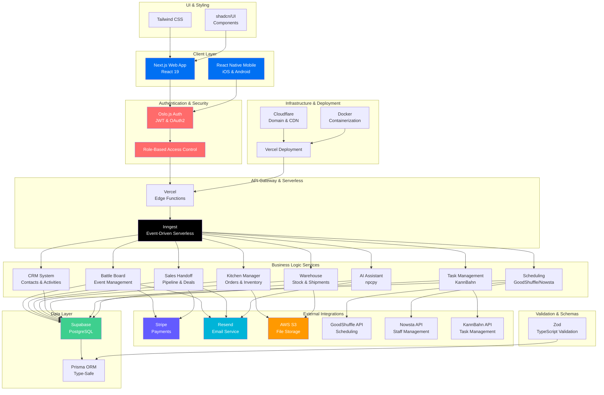
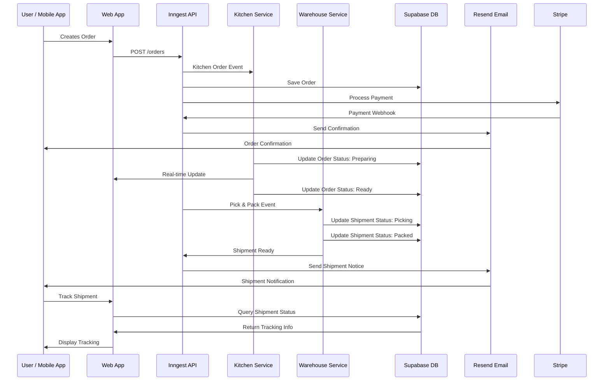
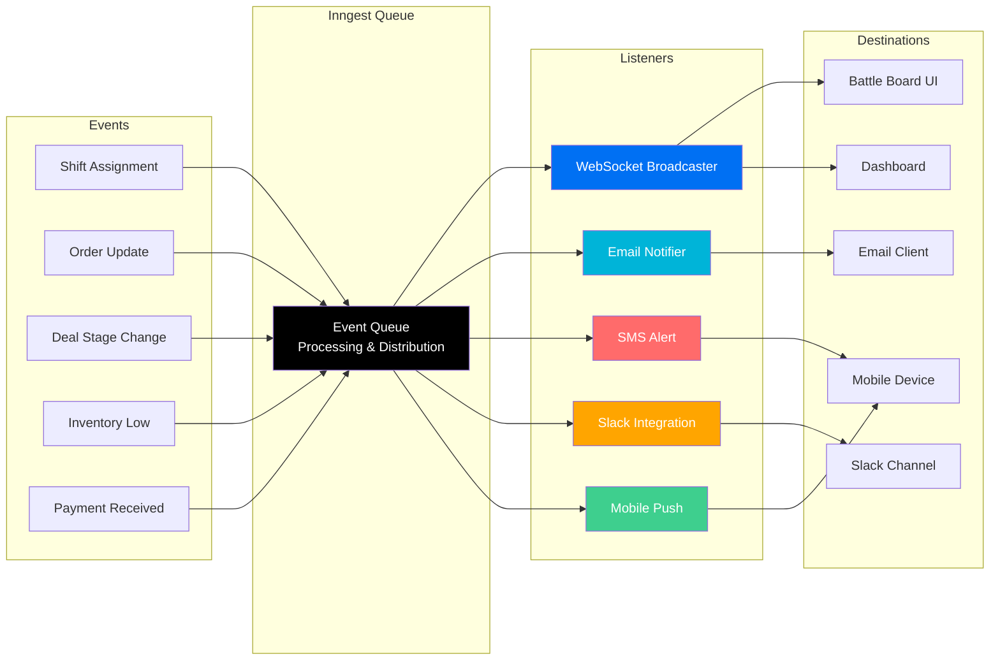
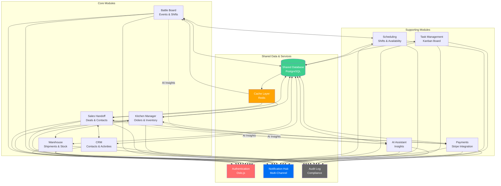
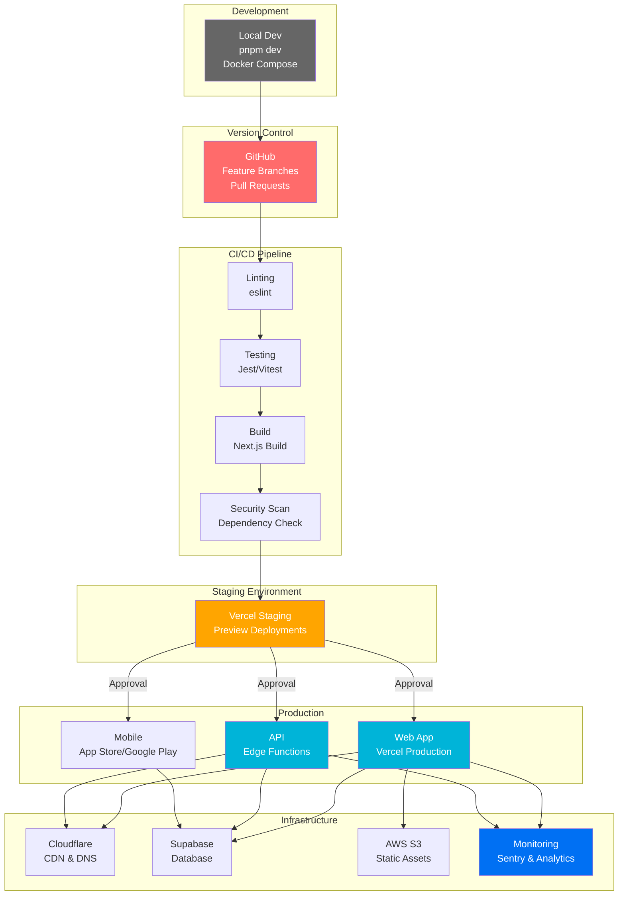
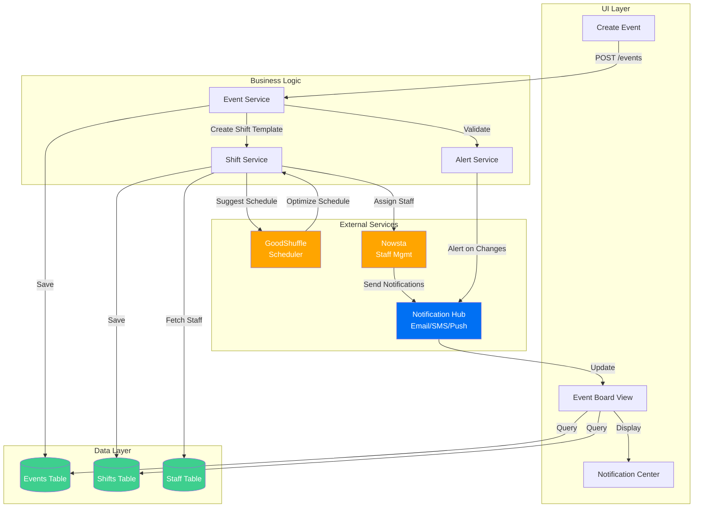
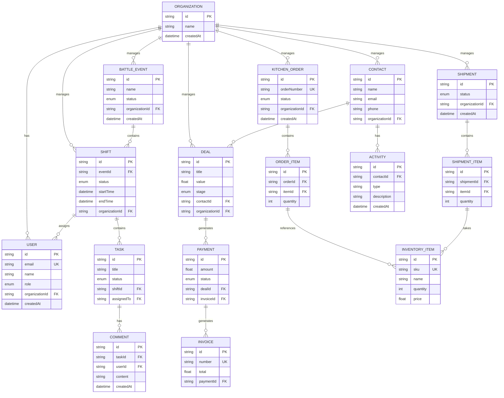
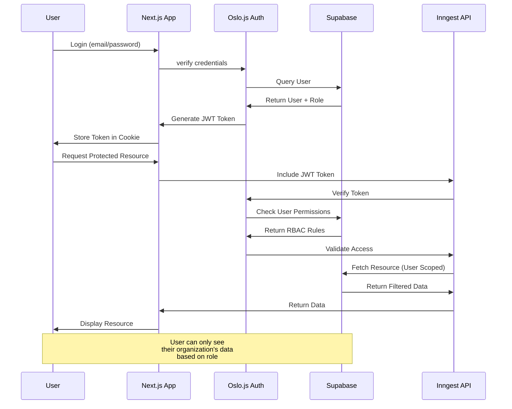
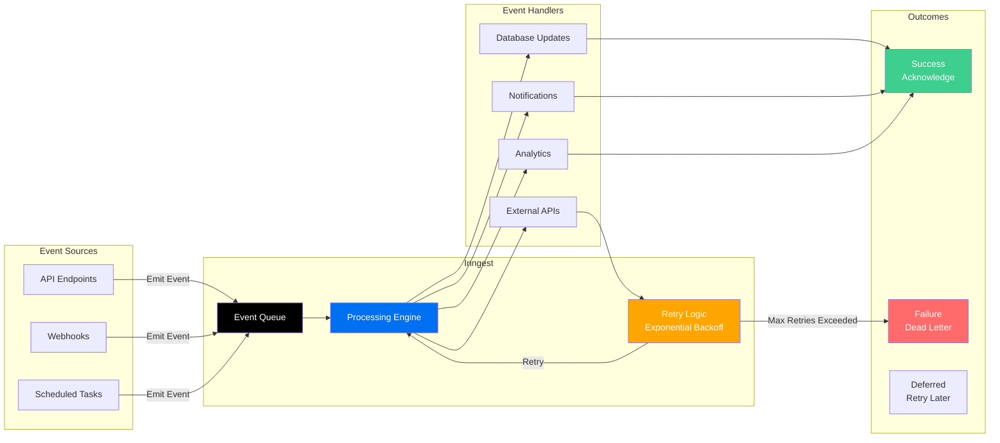

# HQ Operations System - Detailed Architecture Diagrams

## 1. System Architecture Overview

---

## 2. Data Flow: Order to Shipment

---

## 3. Real-Time Event Distribution

---

## 4. Module Integration & Data Sharing

---

## 5. Deployment Architecture

---

## 6. Battle Board Module - Detailed Flow

---

## 7. Database Relationships

---

## 8. Authentication & Authorization Flow

---

## 9. Inngest Event Processing Pipeline

